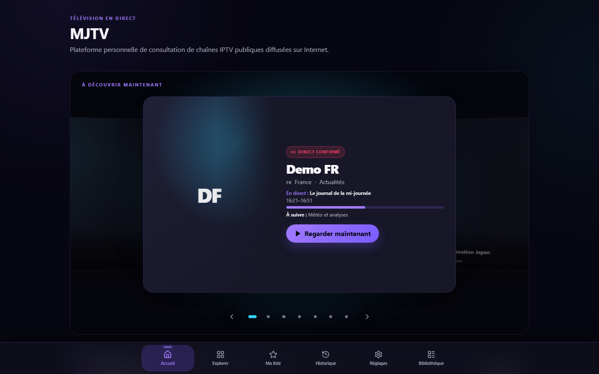
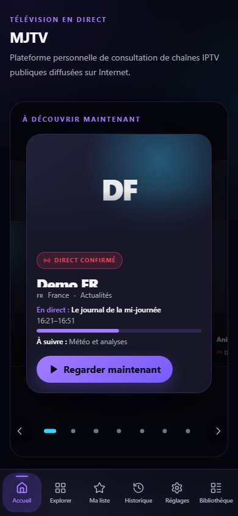

# MJTV

<div align="center">
  
  <br />
  <strong>Le direct, mieux présenté.</strong>
  <br />
  Une expérience IPTV éditoriale, progressive et pensée pour tous les écrans.
</div>

<br />


Plateforme personnelle de consultation de chaînes IPTV publiques diffusées sur Internet.

MJTV agrège des métadonnées et des liens de flux externes issus notamment du catalogue
[iptv-org](https://github.com/iptv-org/api). Le navigateur récupère les flux vidéo directement
depuis leur origine : le serveur MJTV ne les héberge pas, ne les télécharge pas, ne les retransmet
pas et ne les enregistre pas.

## Fonctionnalités

- Accueil éditorial responsive avec carrousel cinématique, navigation clavier, gestes tactiles et
  prise en charge de `prefers-reduced-motion`
- Sélection des chaînes fondée sur la qualité du catalogue et la santé réelle des sources
- Recherche insensible à la casse et filtres par pays, catégorie, langue et disponibilité
- Programmes EPG actuel et suivant, horaires et progression, avec fallback non bloquant
- Lecteur HLS natif sur Safari/iOS et fallback HLS.js sur les autres navigateurs
- Favoris, historique limité à 50 entrées et réglages persistants dans un stockage versionné
- Sous-titres intégrés et import local de fichiers `.vtt`
- Import local de playlists `.m3u` et `.m3u8`, conservées dans IndexedDB
- PWA installable depuis Safari avec écran hors ligne et sans mise en cache vidéo
- Crédit du créateur intégré discrètement en bas de l'accueil

## Aperçu de l'interface

L'accueil met la chaîne active au premier plan, affiche le programme en cours et le suivant, puis
organise le reste du catalogue en sélections éditoriales. Les visuels ci-dessous proviennent des
fixtures déterministes de la suite E2E : ils représentent l'interface réellement testée.

<table>
  <tr>
    <th width="68%">Desktop</th>
    <th width="32%">Mobile</th>
  </tr>
  <tr>
    <td valign="top">
      
    </td>
    <td valign="top" align="center">
      
    </td>
  </tr>
</table>

L'animation du bandeau repose uniquement sur SVG/CSS et s'arrête automatiquement lorsque
`prefers-reduced-motion: reduce` est activé.

## Architecture

```text
src/
  app/              # App Router, page principale et routes API
  components/       # Shell, navigation, feedback et crédit créateur
  config/           # Configuration publique, environnement et navigation
  features/
    catalog/        # Normalisation, santé, curation, recherche et présentation
    epg/            # Modèle, mapping, providers, cache et projection publique
    player/         # Stratégies HLS/MP4 et cycle de vie du lecteur
    favorites/      # Favoris persistants
    history/        # Historique de lecture
    settings/       # Préférences utilisateur
    subtitles/      # Pistes distantes et import VTT local
    imported-playlists/ # Parsing M3U et stockage IndexedDB
  lib/              # HTTP, erreurs, stockage, journalisation et utilitaires
```

Le catalogue est normalisé côté serveur par le BFF Next.js, enrichi d'une projection publique de
santé et d'EPG, puis paginé via `/api/catalog`. Les données internes d'audit, les mappings EPG et le
catalogue brut ne sont pas exposés au navigateur.

L'EPG est un enrichissement progressif : une donnée absente, périmée ou indisponible ne bloque ni
le catalogue ni la lecture. L'architecture détaillée est décrite dans
[`docs/EPG_ARCHITECTURE.md`](docs/EPG_ARCHITECTURE.md).

## Stack

- Next.js 16 (App Router), React 19 et TypeScript strict
- Tailwind CSS 4, primitives shadcn/ui et composants personnalisés
- hls.js, idb-keyval et Zustand
- Zod et Lucide React
- Vitest, Testing Library et Playwright

## Prérequis

- Node.js 22 ou une version LTS plus récente
- npm 11+

## Installation

```bash
npm ci
```

Copier ensuite `.env.example` vers `.env.local` :

```powershell
# Windows PowerShell
Copy-Item .env.example .env.local
```

```bash
# macOS / Linux
cp .env.example .env.local
```

## Variables d'environnement

| Variable                                | Description                                     | Défaut  |
| --------------------------------------- | ----------------------------------------------- | ------- |
| `NEXT_PUBLIC_APP_NAME`                  | Nom de l'application                            | `MJTV`  |
| `NEXT_PUBLIC_DEFAULT_COUNTRY`           | Code du pays préféré                            | `FR`    |
| `NEXT_PUBLIC_DEFAULT_LANGUAGE`          | Code de la langue préférée                      | `fra`   |
| `NEXT_PUBLIC_ENABLE_DEBUG`              | Active les informations de diagnostic publiques | `false` |
| `NEXT_PUBLIC_ENABLE_EPG`                | Active l'enrichissement EPG configuré           | `false` |
| `NEXT_PUBLIC_ENABLE_CINEMATIC_CAROUSEL` | Active le carrousel cinématique de l'accueil    | `true`  |
| `IPTV_DATA_REVALIDATE_SECONDS`          | Durée du cache serveur du catalogue             | `21600` |

Désactiver `NEXT_PUBLIC_ENABLE_CINEMATIC_CAROUSEL` restaure le hero statique sans modifier les
autres sections de l'accueil.

## Commandes

```bash
npm run dev          # Serveur de développement sur le port 3000
npm run format:check # Vérification Prettier
npm run lint         # ESLint
npm run typecheck    # tsc --noEmit
npm run test         # Tests unitaires Vitest
npm run build        # Build Next.js standalone
npm run test:e2e     # Tests Playwright
npm run check        # lint + typecheck + test
```

Le build copie automatiquement `public` et `.next/static` dans `.next/standalone` avec un script
Node multiplateforme.

## Tests et qualité

Le quality gate GitHub Actions exécute le formatage, le lint, le typecheck, les tests unitaires, le
build et les tests E2E sans accès obligatoire à un service EPG distant.

État de référence après l'intégration du carrousel cinématique :

- 254 tests unitaires Vitest réussis ;
- 156 exécutions Playwright réussies ;
- Chromium desktop et mobile : PASS ;
- WebKit desktop et mobile : PASS.

Les fixtures couvrent notamment la santé des sources, la curation éditoriale, l'EPG, la lecture,
la persistance, le crédit créateur et les largeurs mobiles de 320, 375, 390 et 430 px.

## Accueil et accessibilité

Le carrousel ne propose que des chaînes disposant d'au moins une source active et d'un état de santé
compatible. Il prend en charge les boutons précédent/suivant, les indicateurs, les flèches du
clavier, le swipe et une action de lecture explicitement nommée. Le titre reste non interactif.

Les sections éditoriales utilisent la même autorité centrale de santé afin de ne pas recommander une
chaîne archivée, sans source ou signalée comme indisponible. En l'absence d'image distante valide,
l'interface affiche un fallback déterministe et accessible.

## PWA — installation sur iPhone

1. Ouvrir MJTV dans Safari.
2. Toucher le bouton Partager.
3. Choisir « Sur l'écran d'accueil ».
4. Ouvrir MJTV depuis son icône.

Le service worker met en cache le shell de l'application (HTML, CSS, JavaScript et icônes), mais
jamais les segments vidéo (`.m3u8`, `.ts`, `.m4s`, `.mp4`) ni les requêtes Range.

## Import M3U

1. Ouvrir l'onglet « Bibliothèque ».
2. Sélectionner un fichier `.m3u` ou `.m3u8` local.
3. Le fichier est analysé dans le navigateur et stocké dans IndexedDB.
4. Les protocoles dangereux (`javascript:`, `data:`, `file:`, `rtmp:`, `udp:`) sont refusés.
5. Les flux nécessitant un referer ou un User-Agent personnalisé sont marqués `limited`.

Aucune donnée de playlist n'est envoyée au serveur.

## Limites connues

- Les flux externes peuvent être indisponibles, géobloqués ou bloqués par CORS.
- Les flux HTTP sont bloqués depuis une page HTTPS (mixed content).
- Les flux exigeant des en-têtes personnalisés ne sont pas lisibles directement par le navigateur.
- Le provider EPG actuel est déterministe et extensible ; aucune source distante réelle n'est
  requise ni activée par défaut.
- Une chaîne sans mapping EPG reste disponible et affiche « Programme non disponible ».
- La disponibilité des sous-titres dépend du flux.

## Sécurité

- Validation Zod des données externes et projections API publiques explicites
- Aucun `dangerouslySetInnerHTML`
- Aucun proxy générique ni endpoint `fetch?url=`
- CSP stricte dans `next.config.ts`
- En-têtes `X-Content-Type-Options`, `Referrer-Policy`, `Permissions-Policy` et
  `X-Frame-Options: DENY`
- Liens externes avec `rel="noopener noreferrer"`
- Aucun secret côté client ni credential Cloudflare dans le dépôt

Voir [`docs/SECURITY.md`](docs/SECURITY.md).

## Cadre légal

- MJTV ne fournit, ne stocke et ne retransmet aucune vidéo.
- Les liens proviennent de sources externes publiques dont la disponibilité n'est pas garantie.
- La présence d'un lien dans une liste publique ne garantit pas tous les droits d'exploitation.
- MJTV ne contourne ni DRM, ni géoblocage, ni abonnement.
- Les contenus NSFW, les entrées bloquées et les chaînes archivées sont exclus des recommandations.
- L'utilisateur reste responsable des playlists personnelles qu'il importe.

Voir [`docs/LEGAL.md`](docs/LEGAL.md).

## Documentation complémentaire

- [`docs/ARCHITECTURE.md`](docs/ARCHITECTURE.md)
- [`docs/EDITORIAL_HOME_ARCHITECTURE.md`](docs/EDITORIAL_HOME_ARCHITECTURE.md)
- [`docs/EPG_ARCHITECTURE.md`](docs/EPG_ARCHITECTURE.md)
- [`docs/DEPLOYMENT.md`](docs/DEPLOYMENT.md)
- [`docs/DOMAIN_AND_TUNNEL_SETUP.md`](docs/DOMAIN_AND_TUNNEL_SETUP.md)

## Statut du projet

- Catalogue, recherche, curation et contrôle de santé : fonctionnels
- Lecteur : HLS natif, HLS.js, fallback MP4, erreurs typées et nettoyage du cycle de vie
- Accueil : carrousel cinématique, sections éditoriales et crédit créateur
- EPG V1 : programme actuel/suivant, progression, cache borné et fallback non bloquant
- PWA, favoris, historique, sous-titres et import M3U : fonctionnels
- Format, lint, typecheck, tests, build et matrice E2E : validés dans GitHub Actions
